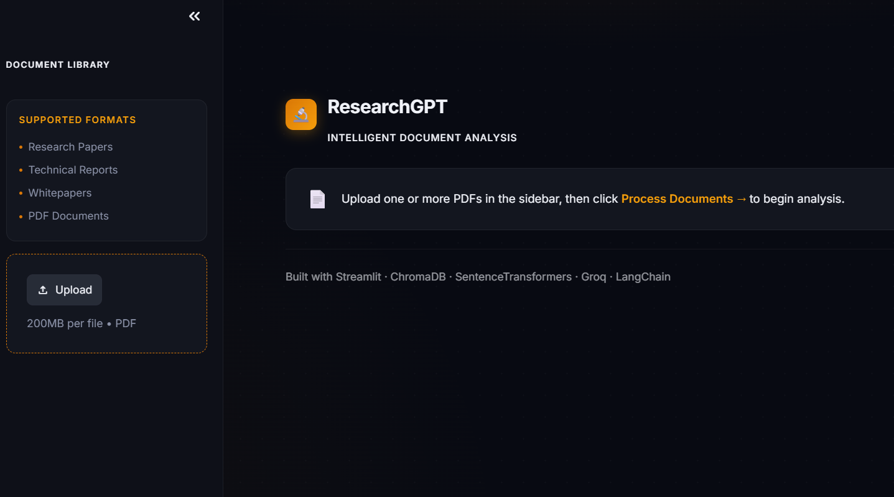
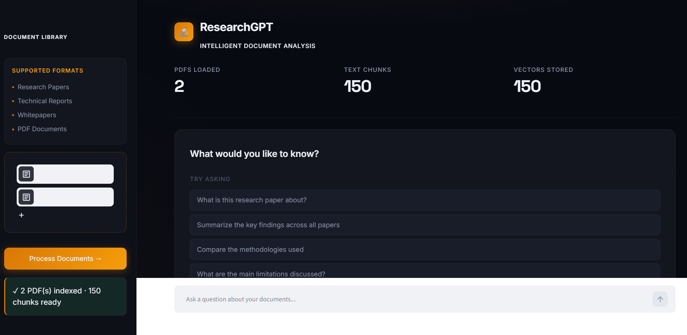
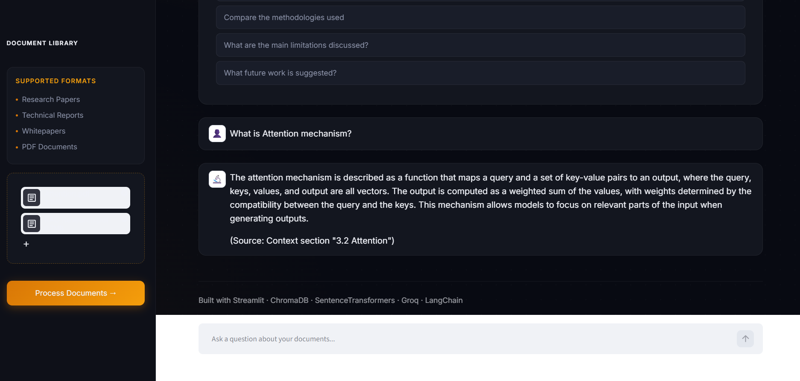

# 📚 Research Paper Assistant — RAG Based AI System

An AI-powered research assistant built using **Retrieval-Augmented Generation (RAG)** that enables users to upload research papers, perform semantic search, and ask context-aware questions using Large Language Models (LLMs).

The system processes academic documents, creates vector embeddings, retrieves relevant context, and generates grounded responses to reduce hallucination and improve answer accuracy.

---

## 🚀 Features

- 📄 **Research Paper Processing**
  - Upload and analyze academic PDFs
  - Extract and preprocess document content

- 🔎 **Semantic Search**
  - Converts documents into vector embeddings
  - Retrieves relevant information using similarity search

- 🤖 **RAG-Based Question Answering**
  - Combines retrieval + LLM generation
  - Provides context-aware answers from uploaded papers

- 🧠 **AI-Powered Insights**
  - Research paper summarization
  - Concept explanation
  - Question answering

- ⚡ **Interactive Web Interface**
  - Streamlit-based application
  - Real-time document querying

---

## 🏗️ System Architecture

```
User Query
     |
     ↓
Streamlit Application
     |
     ↓
RAG Pipeline
     |
 ┌───────────────┐
 │ Document Load │
 └───────────────┘
     |
     ↓
Text Chunking
     |
     ↓
Embedding Generation
     |
     ↓
Vector Database
     |
     ↓
Similarity Retrieval
     |
     ↓
LLM Response Generation
     |
     ↓
Final Answer
```
## 🖥️ Application Demo

### Research Paper Upload



### AI Question Answering



### Retrieved Context & Response


---

## 📂 Project Structure

```
RESEARCH PAPER ASSISTANT
│
├── data/
│   └── Research papers / uploaded documents
│
├── rag_env/
│   └── Virtual environment
│
├── src/
│   │
│   ├── document_loader.py
│   │   └── PDF document ingestion
│   │
│   ├── chunker.py
│   │   └── Text splitting and preprocessing
│   │
│   ├── embedding.py
│   │   └── Document embedding generation
│   │
│   ├── vector_store.py
│   │   └── Vector database creation and storage
│   │
│   ├── retriever.py
│   │   └── Relevant context retrieval
│   │
│   ├── llm.py
│   │   └── LLM integration
│   │
│   ├── prompt.py
│   │   └── Prompt engineering templates
│   │
│   └── rag_pipeline.py
│       └── End-to-end RAG workflow
│
├── app.py
│   └── Streamlit application
│
├── requirements.txt
│
└── README.md
```

---

## 🛠️ Tech Stack

**Programming Language**
- Python

**AI / ML**
- Large Language Models (LLMs)
- Retrieval-Augmented Generation (RAG)
- Natural Language Processing (NLP)
- Text Embeddings

**Frameworks & Libraries**
- LangChain
- Streamlit
- PyPDF
- Chromadb / Vector Database
- Sentence Transformers

**Core Concepts**
- Semantic Search
- Vector Similarity Search
- Prompt Engineering
- Context Retrieval
- Document Processing

---

## ⚙️ Installation

Clone the repository:

```bash
git clone https://github.com/yourusername/research-paper-assistant.git
```

Navigate to project folder:

```bash
cd research-paper-assistant
```

Create virtual environment:

```bash
python -m venv rag_env
```

Activate environment:

Windows:

```bash
rag_env\Scripts\activate
```

Linux/Mac:

```bash
source rag_env/bin/activate
```

Install dependencies:

```bash
pip install -r requirements.txt
```

---

## ▶️ Run Application

Start Streamlit:

```bash
streamlit run app.py
```

Open in browser:

```
http://localhost:8501
```

---

## 🔄 RAG Pipeline Workflow

1. Upload research paper PDF
2. Extract text from document
3. Split text into meaningful chunks
4. Generate vector embeddings
5. Store embeddings in vector database
6. Retrieve relevant document sections
7. Pass retrieved context to LLM
8. Generate final response

---

## 📊 Performance Highlights

- Processes research documents automatically
- Enables semantic document retrieval
- Reduces manual literature review effort
- Provides grounded responses using retrieved context
- Modular architecture for easy model replacement

---

## 🔮 Future Improvements

- Add multi-document comparison
- Add citation generation
- Add conversation memory
- Support multiple file formats
- Deploy with cloud-based vector database
- Add user authentication

---

## 👩‍💻 Author

**Yamini**

GitHub: https://github.com/Yamini-678

---

⭐ If you find this project useful, consider starring the repository!